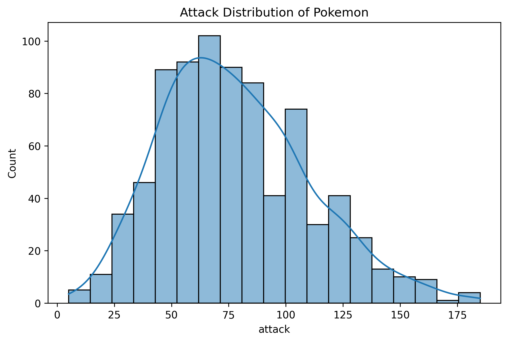

In the battle, we definitely want to have Each Pokémon has its own 6 basic natures: HP, Attack, Defense, Special Attack, Special Defense and Speed.  

First we want to see the overall distributions of 6 basic natures: HP, Attack, Defense, Special Attack, Special Defense and Speed. The plots are seen below. It is seen that if a kind of nature is over 100, we can see it as a high number. 

Then we want to find whether there are some pairs of natures that have relation with each other. However, from the figures below, we cannot see any relation.

It is not easy to see any details from the general information above. Actually, in order to judge whether a pokemon is useful in battles, we believe that a pokemon that is used more frequently is more useful. This is what the Tier stands for. The Tier of pokemons consists of values: 'Uber', 'RU', 'OU', 'UUBL','UU','RUBL', 'RU', 'NUBL', 'NU','PUBL', 'PU' and 'LC'. Since 'Uber' represents the pokemons that are banned using and 'LC' represents the pokemons that are too weak to be taken into account when players are arranging their teams, we only use the left tiers. Therefore, the left ones are 'OU', 'UUBL','UU','RUBL', 'RU','NUBL', 'NU','PUBL' and'PU', where 'OU' represents the most frequently used ones and 'PU' the least. Then, it is common to believe the total of 6 basic natures reveals a pokemon's power. A higher of total number is, a stronger pokemon is revealed. Therefore, we want to visualize the relation between Tier and the total as follows. We can see it almost meets our expectations.

We also want to see which side(offense or defense) of battles players are more likely to emphasize. Generally, we only want a pokemon to become either an Attacker or a Special Attacker, so the offensive will be either Attack or Special Attack plus Speed that determines the sequence of moves. Therefore, we define offense total as "max[Attack, Special Attack] + Speed". For defense side, we define defense total as "Defense + Special Defense + HP". The visualization is seen below:

We can see that the trend of Defense total is closer to the sequence of usage rate than that of Offense total does. Thus, players tend to care more about pokemons; defense natures.

We can also combine both defense total and offense total and define the sum of them as "Effective total". And it is shown as below:

