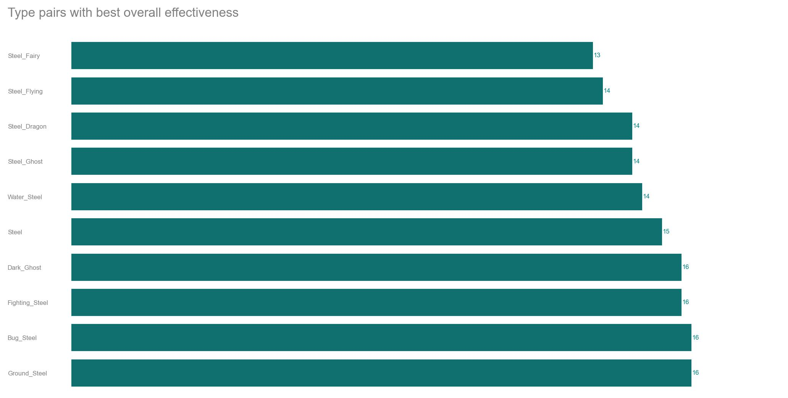

Each Pokemon has a primary type (type1) and maybe a secondary type (type2). Possible types are grass, water, fire, normal, electric, etc. For every type, there is an against_type value. For instance, there are columns in our dataset called ‘against_bug’, ‘against_dark’, ‘against_fairy’, and ‘against_flying. These values measure the amount of damage taken against an attack of a particular type. Note that the smaller the against values are, the better. Thus, these against values actually measure effectiveness. It is natural to ask: which type is the strongest? Which combination of types is the strongest? 

To begin with, we want to examine how prevalent each primary type is. From Figure 1, you can tell that a larger area means there is more of this type.We are envisioning an interaction where you can click a rectangle (a type), and all Pokemons of this type appear. We may use D3 to implement this. 

Then, we explore the primary and secondary types. In Figure 2,  we illustrate the count of each type as primary type and secondary type using a barchart. We are thinking about adding interaction to the plot so that when you toggle over a bar (e.g. flying and type1), the corresponding names of Pokemon will pop up. We can use D3 or Python’s Plotly to do this.

Now we look at the combination of Pokemon types. From Figure 3, we can tell that the most common Pokemon type combination is ‘Normal_Flying’. This plot is useful for our further analysis. 

Moreover, we plot a heatmap demonstrating each type with its corresponding effectiveness against every other type (Figure 4). The lower the value, the better. Here, we apply the knowledge about color and perception we learned in class. Bigger values correspond to darker colors. We try to choose colors that are pleasing for the eyes and easy to comprehend.

At last, we can find out which pair of types has the best overall effectiveness. We add up all the against columns to represent the overall effectiveness. It turns out ‘Steel_Fairy’ has the best overall effectiveness (See Figure 5). 

The above is various pieces of information that we extracted from the dataset. We want to integrate them into one or two graphs to tell a whole story. One idea is that when a Pokemon player look at our website, he/she can learn which secondary type to choose for a given primary type.  
