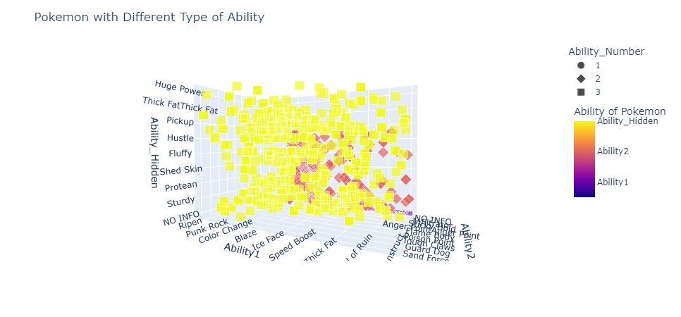
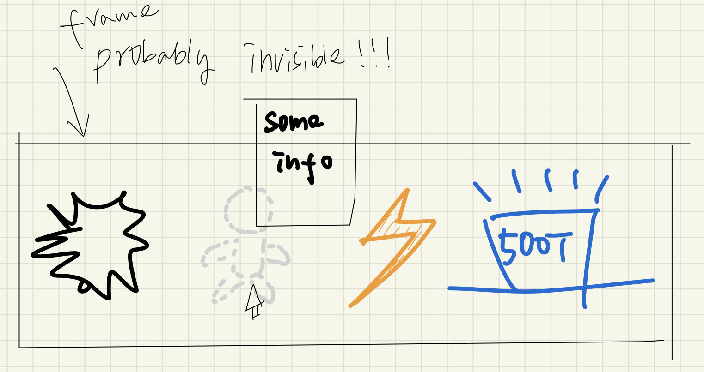

### Abilities: which one should be used?
Every Pokemon could take 1 to 3 *abilities*. Therea are in total 295 abilities. However when during combat, a pokemon could only choose one ability to battle. As a demonstration we plot the ability distribution of pokemonsWe are interested in what are the *abilities* of interest we want to recommend to pokemon users.



It is therefore import to choose an ability wisely as it's directly linked to a strong pokemon.

### How do we rank abilities?

Every Pokemon has an attribute *Tier*, it takes the following different values: ```['PU', 'LC', 'NU', 'Uber', 'RU', 'UUBL', 'UU', 'OU', 'PUBL','AG'
'NUBL', 'RUBL', 'Limbo']```, among them, except for 'Uber', 'Limbo' and 'AG' which are banned using, ```OU``` means the pokemon is the most used. We will therefore rank ablities in terms of the frequentcy appeared in the ```OU``` Tier.

We already have a result:

|    | Ability           |   Count |

|---:|:------------------|--------:|

| 46 | 'Telepathy'       |       4 |

|  1 | 'Regenerator'     |       4 |

|  5 | 'Beast Boost'     |       3 |

| 29 | 'Levitate'        |       2 |

| 40 | 'Keen Eye'        |       2 |

| 33 | 'Sturdy'          |       2 |
| 22 | 'Limber'          |       2 |

| 12 | 'Mold Breaker'    |       2 |

| 19 | 'Battle Bond'     |       2 |

|  8 | 'Serene Grace'    |       2 |

|  4 | 'Pressure'        |       2 |

| 38 | 'Disguise'        |       1 |

For the sake of visualization, we are thinking about creating a horizontal sliding bar which contains the top 5 most popular abilities. Inside of the sliding bar there are 5 different icons symboling each ablity. When the mouse moves onto each icon, detailed information of the ability will be shown. This could be implemented with simple engineering.



